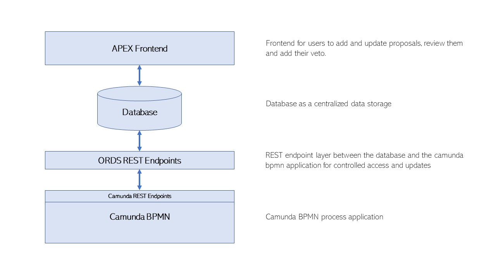
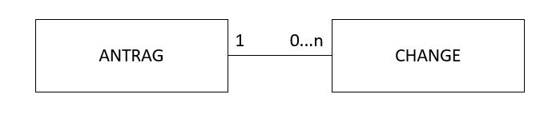

# **Process Documentation**

## 1. Project Scope
The scope of the project is to investigate how the digitalisation affects business processes in an enterprise, how an ideal interaction of natural and artificial intelligence in an organisational environment can be achieved, and how cooperation and partnership among humans and technology can result in adequate business process execution. This investigation will be realised by application, implementation and demonstration of real prototypical instantiations.

## 2. Team Members

| Name | Email |
|---|---|
| Jasmin Fluri  | jasmin.fluri@fhnw.ch |
| Alena Magliano | alena.magliano@students.fhnw.ch |
| Alain Schmutz | alain.schmutz@students.fhnw.ch |

## 3. Use Case Identification
The team has worked together in a brainstorming phase on identification of use case they would like to work on. It was decided to model a process owned by company of one of the team members. The process presents the procedure for the new proposals with respect to changing the business guidlines, innovation, general improvements or future events inside the company. It has to be pointed out that the process does not relate to external clients.

## 4. Scenario and User Experience (UX)

### Project Use Case

The company structure of Schaltstelle (schaltstelle.ch) allows each member of the company to have the same power of co-decision. No management rules over the company. If decisions have to be made, the members decide according to the principle of consent. The principle of consent means, as long as no member disapproves, the voting at hand is accepted. 

If a topic needs to be put to the vote, the related member has to explain it to the others, so that they can veto against it, if they disapprove. If any member disapproves, the proposal is declined. It is not a majority decision where the outcome is defined in what most members vote. 

Votings of proposals and their discussion and improvement suggestions are currently set up as a Telegram chatroom. The structure of a chatroom complicates the tracking of the status of proposals and their outcomes.

## 5. Process Modelling

The process contains three roles: A requester, an innovation manager and the remaining members of the company.

| Role | Description |
|---|---|
| Requester | Person who can raise the new proposal and is necessarily a member of the company. |
| Innovation Manager | Person who is responsible for reviewing the new proposal. He makes suggestions to refine the proposal before it is up for voting. |
| Members | Members of the company who can make use of the right to veto. Any member has the possibility to propose requests. |

 Proposals that are up for voting can be classified amongst the following categories: 
 * Change of business guidelines (code of conduct, code of ethics)
 * Innovation (new business ideas or projects)
 * General improvements (office, infrastructure, technologies)
 * Future events (regulars' table, networking events, team events)
 * Marketing (social media, website, sponsoring)
 * New Member

The current process to request proposals is done in the chat application Telegram. There is no overview of the ongoing proposals, no possibility for improvement suggestions by other members of the company and discussions are hard to follow.

## 6. Process AS-IS Description

### Process AS-IS Description

The process starts with the requester creating a proposal. It must be phrased to allow a yes / no decision. The Chief of innovation reviews the proposal. If the proposal is not complete, it is handed back to the requester. If the Chief of innovation declares the proposal as complete, the proposal is ready for voting. Next, the members need to decide if they want a pitch or presentation of the proposal to learn about its details. This can help to get a better understanding of the request or the idea. If not, the 10 days right to veto starts for all the members. During this period, two tasks commence: 
- Members of the company could suggest improvements to the proposal. The improvements can be accepted by the requester and implemented into the description. If the requestor rejects the improvements, nothing changes.
- Members of the company can make use of their right to veto. If at least one member makes the use of the right to veto, the proposal is declined, and the process ends. If the members do not make their use of the right to veto within the ten days, the proposal is accepted, and the process ends.

## 7. Decision Logic

Decision logic is a verification system enabling the company automatically verify the proposal information relating to category and requested budget. Decision logic is defined in a decision table which consists of inputs, outputs and rules. The inputs are conditions and the outputs are the conclusion of the rules. In the above described AS-IS Process, the members have to decide if they want a pitch or presentation of the proposal. This step can be automated with the help of decision table. With the pre-defined inputs, outpus and rules can be decided if the presentation is needed or not.
In the decision table there are 2 input columns and one output columns.

INPUT                     
* Proposal Category        
* Amount Budgeted

OUTPUT
 * Decision Outcome

The following conditions have been defined to design a decision model to decide whether the presentation or pitch is needed:
1. If the proposal category is innovation and the amounted budget is greater than CHF 1000 then the presentation or pitch is needed.
2. If the proposal category is marketing and the amounted budget is greater than CHF 2000 then the presentation or pitch needed.
3. If the proposal category is future events and the amounted budget is greater than CHF 3000 then the presentation or pitch needed.
4. If the proposal category is new members then the presentation or pitch is always needed.
5. The presentation or pitch is required only for conditions 1.-4.

|Proposal Category | Amount Budgeted | Decision Outcome|
|---|---|---|
| Innovation | > 1000 |true|
| Marketing | > 2000 |true|
| Future Events | > 3000 |true|
| New Members | > 0 |true|
|"Innovation","GeneralImprovements","FutureEvents","Marketing" "ChangeOfBusinessGuidelines"|- |false|

## 8. Identification of Digitalisation Aspects
There are several factors why the current process can be enriched by a more modern process:
* Simplification and clear structuring of the application process
* Today all changes are made manually
* In the telegram chat, a new request usually triggers a discussion. But it should be suggestions, not discussions.
* Zeitrahmen zu veto sind manuell
* History is not guaranteed (when did Veto start, when did it stop, etc.). Until now it was necessary to search the history in telegrams to find the contents again. This was inefficient and error-prone.

## 9. Process TO-BE Description

### Digitized Process Architecture

Oracle APEX is a free tool for rapid application development that helps in developing and publishing desktop and mobile applications.

### Process TO-BE Description

The TO-BE process prepared in Camunda Modeler has been deployed on Heroku.

The most important steps are explained in the table below:

| Task | from | to | HTTP-Request | API | Description |
| --- | --- | --- | --- | --- | --- |
| Start | Apex | Heroku | POST | /process-definition/{id}/start | The trigger starting the process is when a requestor creates a new proposal in the front-end application provided by APEX. To retrieve application data for the business process on Heroku, the API created in Apex is exposed and consumed. |
| Inform Chief of Innovation | Heroku | Apex | POST | /sendMail/ | As soon as an applicant has submitted a new proposal, the Chief of Innovation is being informed via e-mail notification. Apex is triggered by Heroku, which then triggers the sending of mail. |
| Review of Proposal | Apex | Apex | - | - | The Chief of Innovation then reviews the proposal in a manual process. The result of the check is then being updated. The review date, proposal state, review state and the isReviewed flag is being set.|
| Receive Review Outcome | Apex | Heroku | POST | /execution/{id}/signal | As soon as the Chief of Innovation has given an answer to the proposal, the Camunda process is triggered. The CIO can either accept or decline the response, depending on whether it is complete or not. |
| Inform Requester | Heroku | Apex | POST | /sendMail/ | In case that the proposal is not completed, the requestor will be informed to complete the request. |
| Adapt Proposal | Apex | Apex | - | - | The requestor adapts the proposal. |
| Proposal submitted | Apex | Heroku | POST | /execution/{id}/signal | As soon as the adapted Proposal is submitted in APEX, Heroku will trigger the Mail sending. The Chief of Innovation will automatically be informed again and receive a notification email that a request has been adapted and is ready for review. Then the process starts again as described above, where the CIO needs to review the proposal. |
| Set Veto start time | Heroku | Apex | PUT | /setVetoStartDate/{id}/ | If the proposal is complete and there's nothing to add from requesters side, the 10 days right to veto starts for all the members. The start date of the right to veto will be updated in APEX by using HTTP PUT API. |
| Inform Members to Veto | Heroku | Apex | POST | /sendMail/ | The members will be informed about starting the right to veto. During these 10 days, three activities can occur: |
| Members can Veto | Apex | Apex | - | - | The 10 days right to veto will be not interrupted by any cases. Any member of company can make use of its right to veto. _Veto happens in APEX. If a Veto is submitted, a Request to Heroku is made._ |
| Veto submitted | Apex | Heroku | POST | /execution/{id}/signal | As soon as at least one member vetoed, the process will be terminated. |
| Proposal is declined | Heroku | Apex | PUT | /setProposalStatus/{id}/ | The result of the process – acceptance or declination of proposal – is updated in APEX. |
| Improvements to the proposals can be suggested | Apex | Apex | - | - | Any member of the company can suggest improvements for the proposal.|
| Improvements submitted | Apex | Heroku | POST | /execution/{id}/signal | As soon as a member submits improvements, e improvements, Heroku will be triggered again. |
| Inform Requester | Heroku | Apex | POST | /sendMail/ | Improvements will be sent to the requester. After the improvements have been received, the requester can accept suggested improvements and then adapt the original proposal. If the suggested improvements are rejected by requestor, nothing will change. |
| Improvements Submitted | Apex | Heroku | PUT | - | PUT Request that a proposal is submitted |
| Business Rule if Presentation is needed | Heroku | Heroku | - | - | The decision table is used to decide whether a presentation of the requester is necessary or not. If a presentation or pitch is necessary, the requester prepares the pitch or presentation.|
| Update Decision | Heroku | Apex | PUT | /isPitchNeeded/{id}/ | Sets the flag whether a presentation is required or not.|
| Inform Requester about Presentation | Heroku | Apex | POST | /sendMail/ | Requester is informed to make a Presentation about his Request. |
| Organization of Pitch or Presentation | User | User | - | - | Requester then need to prepare the presentation within the 10 days, even if the request can still be rejected with a veto and therefore its preparation would be useless. |
| Proposal is accepted | Heroku | Apex | PUT | /setProposalStatus/{id}/ | The result of the process – acceptance or declination of proposal – is updated in APEX.|
| Inform members and requester | Heroku | Apex | POST | /sendMail/ | Members and Requester are informed about the outcome of the proposal process via Email. |
| End | - | - | - | - | The process ends. |

## 10. Deployement of External Services 

### APEX Frontend
The frontend allows the Schaltstelle Members to create and modify the proposals. It serves as the process GUI. 

### APEX REST Endpoints

All the APEX REST Endpoints for the proposal application are located under the proposal module: 

[https://apex.oracle.com/pls/apex/schaltstelle/proposal/](https://apex.oracle.com/pls/apex/schaltstelle/proposal/)

#### Ressources

|Ressource URI|Methode|Parameters|
|---|---|---|
|change/:id|GET|IN - id|
|change/:id|POST|IN - antrag_id   IN - change_desc   IN - change_titel   OUT - http_status_code|
|has_veto/:id|PUT|IN - id   IN - has_veto   OUT - http_status_code|
|is_pitch_needed/:id|PUT|IN - id   IN - is_pitch_needed   OUT - http_status_code  |
|proposal_status/:id|PUT|IN - id   IN - proposal_status   OUT - http_status_code  |
|proposal_status/:id|GET|IN - id  |
|veto_start_date/:id|PUT|IN - id   IN - veto_start_date   OUT - http_status_code  |

### Oracle Database

The data is stored in an Oracle database. To access and update the data the REST Endpoint described above can be used. 

#### Proposal Table 

| Column Name| Datatype | Nullable | Description |
|---|---|---|---|
|ID|NUMBER|No|Primary Key of the Proposal Table |
|TITLE|VARCHAR2(500)|No|Title of a Proposal|
|DESCRIPTION|VARCHAR2(4000)|Yes|Description of a Proposal|
|APPLICANT|VARCHAR2(100)|No|Applicant of a Proposal - This value is filled automatically with the username of the APEX User|
|BUDGET|NUMBER|Yes|Budget of the proposal|
|CATEGORY|VARCHAR2(255)|No|Category of the proposal - Value is filled with a Dropdown field in the APEX form|
|LINKS|VARCHAR2(4000)|Yes|Additional links for the proposals to external sources|
|SUBMISSION_DATE|TIMESTAMP(6)|No|Submission date of the proposal - This value is automatically filled by the APEX form at the submission of the proposal|
|PROPOSAL_STATUS|VARCHAR2(100)|No|Status of the proposal - This value is initially set by the APEX form. During the process Camunda is tracking the proposal status. - Created / Reviewed / Declined / Accepted / ... |
|IS_REVIEWED|VARCHAR2(50)|Yes|Flag if the proposal is reviewed - Yes / No|
|REVIEW_DATE|TIMESTAMP(6)|Yes|Date of the Review|
|REVIEW_STATUS|VARCHAR2(100)|Yes|Outcome of the review - Approved / Denied|
|IS_PITCH_NEEDED|VARCHAR2(50)|Yes|Flag if Pitch is needed - Yes / No|
|VETO_START_DATE|TIMESTAMP(6)|Yes|Date from when the veto timeframe starts|
|HAS_CHANGE|VARCHAR2(50)|Yes|Status if the proposal has a change from a member - Yes / No|
|HAS_VETO|VARCHAR2(50)|Yes|Outcome if proposal has a veto - Yes / No|
	

#### Change Table

| Column Name| Datatype | Nullable | Description |
|---|---|---|---|
|ID|NUMBER|No|Primary Key of the Change Table|
|ANTRAG_ID|NUMBER|No|Foreign Key to the Proposal Table|
|CHANGE_TITEL|VARCHAR2(100)|No|Title of a change|
|CHANGE_DESC|VARCHAR2(4000)|Yes|Description of a change|
|IS_ACCEPTED|VARCHAR2(50)|Yes|Flag if Change is accepted from applicant|

## 11. Deployment of Project
// Picture of the deployment 

## 12. Testing of Project 
// How we tested the endpoints with Postman.

## 13. Summary
// TODO, when ready
// What is now better with the digitized process? Before and after comparison.