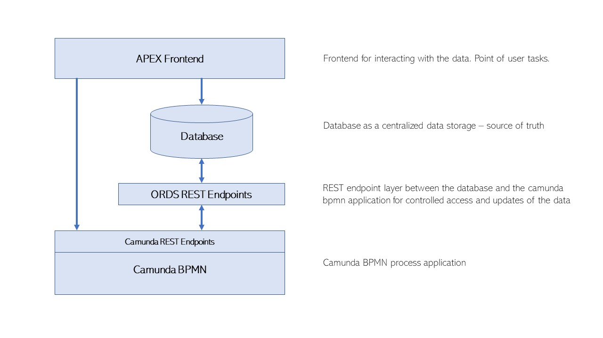

# **Process Documentation**

## 1. Project Scope
The scope of the project is to use the advantages of digitalization to improve existing processes within an organization.  This digitalization is done by implementing an automated process inside a process engine, that supports the users with an ideal interaction of natural and artificial intelligence. The goal is to improve a process and integrate a clear structure inside the automated process execution. 

## 2. Team Members

| Name | Email |
|---|---|
| Jasmin Fluri  | jasmin.fluri@fhnw.ch |
| Alena Magliano | alena.magliano@students.fhnw.ch |
| Alain Schmutz | alain.schmutz@students.fhnw.ch |

## 3. Use Case Identification
The team has worked together in a brainstorming phase to identify the use case.  It was decided to model a process owned by the company of one of the team members. The process describes the procedure for new proposals inside the company that can change business guidelines, start innovations, suggest general improvements or future events inside the company. It has to be pointed out that the process does not include communication with the clients of the company. It is only applied within the company by all the members.

## 4. Scenario and User Experience (UX)

### Project Use Case

The company structure of Schaltstelle (schaltstelle.ch) allows each member of the company to have the same power of co-decision. No management rules over the company. If decisions have to be made, the members decide according to the principle of consent. The principle of consent means, as long as no member disapproves, the voting at hand is accepted. 

If a topic needs to be put up for voting, the related member has to explain his proposal to the other members, so that they can veto against it, if they disapprove. If any member disapproves, the proposal is declined. It is not a majority decision where the outcome is defined by what most members vote. 

Votings of proposals and their discussion are currently set up as a Telegram chatroom. The structure of a chatroom complicates the tracking of the status of proposals and their outcomes.

## 5. Process Modelling

The process contains three roles: A requester, an innovation manager, and the remaining members of the company.

| Role | Description |
|---|---|
| Requester | A person who can raise the new proposal and is necessarily a member of the company. |
| Innovation Manager | The person who is responsible for reviewing the new proposal. He makes suggestions to refine the proposal before it is up for voting. |
| Members | Members of the company can make use of the right to veto. Any member can submit proposals. |

 Proposals that are up for voting can be classified amongst the following categories: 
 * Change of business guidelines (code of conduct, code of ethics)
 * Innovation (new business ideas or projects)
 * General improvements (office, infrastructure, technologies)
 * Future events (regulars' table, networking events, team events)
 * Marketing (social media, website, sponsoring)
 * New Member 

The current process to bring in proposals is done in the chat application Telegram. There is no overview of the ongoing proposals by other members of the company, and discussions are hard to follow.

## 6. Process AS-IS Description

The process starts with the requester creating a proposal. It must be phrased to allow a yes / no decision. The Chief of innovation reviews the proposal. If the proposal is not complete, it is given back to the requester. If the Chief of innovation declares the proposal as complete, the proposal is ready for voting. Next, the members need to decide if they want a pitch or presentation of the proposal to learn about its details. This can help to get a better understanding of the request or the idea. If not, the 10 days right to veto starts for all the members. During this period, two tasks commence: 
- Members of the company can make use of their right to veto. If at least one member makes the use of the right to veto, the proposal is declined, and the process ends. If the members do not make their use of the right to veto within the ten days, the proposal is accepted, and the process ends.
- With the help of decision-logic, it will be checked, if a presentation or a pitch is needed. The category and the budget of the proposal are input criteria.

## 7. Decision Logic

The decision-logic is a verification system enabling the company to automatically verify the proposal information relating to category and requested budget. The decision logic is defined in a decision table which consists of inputs, outputs, and rules. The input data are conditions, and the output data is the conclusion of the rules. In the above described AS-IS Process, the members have to decide if they want a pitch or presentation of the proposal. This step can be automated with the help of a decision table. 
In the decision table, there are two input columns and one output column.

INPUT                     
* Proposal Category        
* Amount Budgeted

OUTPUT
 * Pitch

The following conditions have been defined to design a decision model to decide whether the presentation or pitch is required:
1. If the proposal category is innovation, and the budget is higher than CHF 1000, then the presentation or pitch is required.
2. If the proposal category is innovation and the budget is less or equals CHF 1000, then the presentation or pitch is not required. 
3. If the proposal category is marketing, and the budget is higher than CHF 2000, then the presentation or pitch is required.
4. If the proposal category is marketing and the budget is less or equals CHF 2000, then the presentation or pitch is not required.
5. If the proposal category is future events and the budget is higher than CHF 3000, then the presentation or pitch is required.
6. If the proposal category is future events and the budget is less or equals CHF 3000, then the presentation or pitch is not required. 
7. If the proposal category is new members, the presentation or pitch is required no matter what budget was requested. 
8. If the proposal category is general improvements or changes of business guidelines, the presentation or pitch is required no matter what budget was requested. 

|Proposal Category | Amount Budgeted | Decision Outcome|
|---|---|---|
| Innovation | > 1000 |true|
| Innovation | <= 1000 |false|
| Marketing | > 2000 |true|
| Marketing | <= 2000 |false|
| Future Events | > 3000 |true|
| Future Events | <= 3000 |false|
| New Members | >= 0 |true|
|"GeneralImprovements","ChangeOfBusinessGuidelines"|>=0 |false|

## 8. Identification of Digitalization Aspects
There are several factors why a digitized process can enrich the current process:
* Simplification and clear structuring of the application process
* Today all changes are made manually
* In the telegram chatroom, having multiple proposals in parallel can end up in a mess.
* Someone must manually control the time to veto.
* History is not guaranteed (when did veto start, when did it stop, etc.). Until now, it was necessary to search the history in telegrams to find the contents again. This search was inefficient and error-prone.

## 9. Process TO-BE Description

### Digitized Process Architecture

Oracle APEX is a free tool for rapid application development that helps in developing and publishing desktop and mobile applications.

### Process TO-BE Description

The tasks and interface communications of the automated Camunda process are explained in the table below.

| Task | from | to | HTTP-Request | API | Description |
| --- | --- | --- | --- | --- | --- |
| Start | Apex | Heroku | POST | /process-definition/{id}/start | The trigger starting the process is when a requestor creates a new proposal in the frontend application provided by APEX. The API created in Apex is exposed and consumed to retrieve application data for the business process on Heroku. |
| Inform Chief of Innovation | Heroku | Apex | POST | /sendMail | As soon as an applicant has submitted a new proposal, the Chief of Innovation is being informed via email notification. Apex is triggered by Heroku, which then triggers the sending of mail. |
| Review of Proposal | Apex | Apex | - | - | The Chief of Innovation then reviews the proposal in a manual process. The result of the check is then being updated. The review date, proposal state, review state, and the isReviewed flag is being set.|
| Receive Review Outcome | Apex | Heroku | POST | /message | As soon as the Chief of Innovation answered the proposal, the Camunda process is triggered. The CIO can either accept or decline the response, depending on whether it is complete or not. |
| Inform Requester | Heroku | Apex | POST | /sendMail | In case the proposal is not completed, the requestor will be informed to complete the request. |
| Adapt Proposal | Apex | Apex | - | - | The requestor adapts the proposal. |
| Proposal submitted | Apex | Heroku | POST | /message | As soon as the adapted proposal is submitted in APEX, Heroku will trigger the Mail sending. The Chief of Innovation will automatically be informed again and receive a notification email that a request has been adapted and is ready for review. Then the process starts again, as described above, where the CIO needs to review the proposal. |
| Set Veto start time | Heroku | Apex | POST | /setVetoStartDate | If the proposal is complete and there's nothing to add from the requester's side, the ten days right to veto starts for all the members. The start date of the right to veto will be updated in APEX by using HTTP POST API. |
| Inform Members to Veto | Heroku | Apex | POST | /sendMail | The members will be informed about starting the right to veto. During these ten days, two activities can occur: 1) Members of the company can make use of their right to veto. 2) With the help of decision logic will be checked if presentation or pitch is needed.|
| Members can Veto | Apex | Apex | - | - | The ten days right to veto will be not interrupted by any cases. Any member of the company can make use of its right to veto. _Veto happens in APEX. If a Veto is submitted, a Request to Heroku is made._ |
| Veto submitted | Apex | Heroku | POST | /message | As soon as at least one member vetoed, the process will be terminated. |
| proposal is declined | Heroku | Apex | POST | /setProposalStatus | The result of the process – acceptance or declination of the proposal – is updated in APEX. |
| Business Rule if Presentation is needed | Heroku | Heroku | - | - | The decision table is used to decide whether a presentation of the requester is necessary or not. If a presentation or pitch is needed, the requester prepares the pitch or presentation.|
| Update Decision | Heroku | Apex | POST | /isPitchNeeded | Sets the flag whether a presentation is required or not.|
| Inform Requester about Presentation | Heroku | Apex | POST | /sendMail | The requester is informed to make a Presentation about his request. |
| Organization of Pitch or Presentation | User | User | - | - | The requester then needs to prepare the presentation within the ten days, even if the request can still be rejected with a veto and therefore its preparation would be useless. |
| proposal is accepted | Heroku | Apex | POST | /setProposalStatus | The result of the process – acceptance or declination of the proposal – is updated in APEX.|
| Inform members and requester | Heroku | Apex | POST | /sendMail | Members and Requester are informed about the outcome of the proposal process via email. |
| End | - | - | - | - | The process ends. |

## 10. Deployment of External Services 

### APEX Frontend
The frontend allows the Schaltstelle Members to create and modify the proposals. It serves as the process GUI. 

### APEX REST Endpoints

All the APEX REST Endpoints for the proposal application are located under the proposal module: 

[https://apex.oracle.com/pls/apex/schaltstelle/proposal/](https://apex.oracle.com/pls/apex/schaltstelle/proposal/)

#### Resources

|Resource URI|Method|Parameters|
|---|---|---|
|sendMail|POST|IN - ccEmail   IN - emailBody   IN - emailBodyHTML    IN - emailSubject   IN - fromEmail    IN - toEmail |
|isPitchNeeded|POST|IN - id   IN - is_pitch_needed   OUT - status |
|setProposalStatus|POST|IN - id   IN - proposal_status   OUT - status   OUT - location  |
|setVetoStartDate|POST|IN - id   IN - veto_start_date     OUT - status  |

### Oracle Database

The data is stored in an Oracle database. The REST endpoints described above are used from Camunda to access and update the data. The APEX application uses direct database access for creating and updating data. The Schema consists of one table called ANTRAG that is described below.

#### Proposal Table 

| Column Name| Datatype | Nullable | Description |
|---|---|---|---|
|ID|NUMBER|No|Primary Key of the Proposal Table |
|TITLE|VARCHAR2(500)|No|Title of a Proposal|
|DESCRIPTION|VARCHAR2(4000)|Yes|Description of a Proposal|
|APPLICANT|VARCHAR2(100)|No|Applicant of a Proposal - This value is filled automatically with the username of the APEX User|
|BUDGET|NUMBER|Yes| Budget of the proposal|
|CATEGORY|VARCHAR2(255)|No| category of the proposal - Value is filled with a Dropdown field in the APEX form|
|LINKS|VARCHAR2(4000)|Yes|Additional links for the proposals to external sources|
|SUBMISSION_DATE|TIMESTAMP(6)|No|Submission date of the proposal - This value is automatically filled by the APEX form at the submission of the proposal|
|PROPOSAL_STATUS|VARCHAR2(100)|No| status of the proposal - This value is initially set by the APEX form. During the process, Camunda is tracking the proposal status. - Created / Reviewed / Declined / Accepted  |
|REVIEW_DATE|TIMESTAMP(6)|Yes|Date of the Review|
|REVIEW_STATUS|VARCHAR2(100)|Yes| Outcome of the review - Approved / Denied|
|REVIEW_COMMENT|VARCHAR2(4000)|Yes|Comment from the reviewer to the proposal. Change suggestions can be proposed here.|
|IS_PITCH_NEEDED|VARCHAR2(50)|Yes|Flag if Pitch is needed - true / false|
|VETO_START_DATE|TIMESTAMP(6)|Yes|Date from when the veto timeframe starts|
|HAS_VETO|VARCHAR2(50)|Yes|Outcome if the proposal has a veto - true / false|

## 11. Deployment of Project
The project is deployed from the Camunda modeler to Heroku via the "deploy current diagram" button. In the "Cockpit" section in Heroku, the new instance of the process appears with its associated definition and deployment id. The definition id is essential for starting the process from APEX because the POST Request URI needs to know the exact deployment id to create the process instances. For that purpose, a trigger and a stored procedure have been set up in APEX that calls the Camunda REST endpoint when a new proposal is created. The SQL definitions of the Database objects can be found under the path `src\main\db\`. Also, three triggers with associated procedures have been set up in APEX to trigger message intermediate throw events in Heroku to tell the process when a review has been done, when a veto was submitted or when a proposal was edited.

## 12. End-to-End Testing 
End-to-End testing was split into two parts - API's testing and usability testing. The usability testing focused on the user's interaction with the frontend application APEX. For that purpose, test scenarios have been prepared and are presented in section 12.2.

### 12.1 Testing of API's 
All the REST endpoints were tested in POSTMAN. The tables below present the tested URL's representing the API endpoints that are set up. Due to the better readability, two tables were created. The first table presents methods with their own URI's and the second table lists the associated bodies which allow the specification of the data that is needed to send with a request. Raw body data is used to send anything as text. The format of our data is JSON. 

#### API Endpoints

| ID| Name | Method | URL | 
|---|---|---|---|
|1|Process Start|POST|https://emmentaler.herokuapp.com/rest/process-definition/digibp-tobe:2:70314c02-9de2-11ea-9c51-da029e11a7df/start?|
|2|Send Mail|POST|https://apex.oracle.com/pls/apex/schaltstelle/proposal/sendMail|
|3|Review Outcome Received|POST|https://emmentaler.herokuapp.com/rest/message|
|4|Proposal Submitted|POST|https://emmentaler.herokuapp.com/rest/message|
|5| veto Received|POST|https://emmentaler.herokuapp.com/rest/message|
|6|Proposal Status|POST|https://apex.oracle.com/pls/apex/schaltstelle/proposal/setProposalStatus|
|7|Set Veto Start Date|POST|https://apex.oracle.com/pls/apex/schaltstelle/proposal/setVetoStartDate|
|8|Pitch Needed|POST|https://apex.oracle.com/pls/apex/schaltstelle/proposal/setProposalStatus|

#### Associated Bodies

<table>
<tr>
<th>
ID
</th>
<th>
Body
</th>
</tr>

<tr>

<td>
1
</td>

<td>
<pre>
{ 
  "variables": {
    "email" : {
        "value" : "jasmin.fluri@students.fhnw.ch",
        "type": "String"
    },
    "requester" : {
        "value" : "alain.schmutz@students.fhnw.ch",
        "type": "String"
    },
    "budget" : {
        "value" : 5000,
        "type": "Integer"
    },
    "proposalId" : {
        "value" : 361,
        "type": "Integer"
    },
    "category" : {
        "value" : "Innovation",
        "type": "String"
    }
  },
 "businessKey" : "proposalProcessAPEX"
} 
</pre>
</td>

</tr>

<tr><td>2</td><td>
<pre>{
    "toEmail": "jasmin@schaltstelle.ch",
    "fromEmail": requester,
    "ccEmail": "a.magliano@hotmail.com",
    "emailSubject": "A new proposal is ready to review",
    "emailBody": "A new proposal was submitted in APEX and is ready 
    to review!",
    "emailBodyHTML": "A new proposal was submitted in APEX and is 
    ready to review!"
}</pre>
</td></tr>

<tr><td>3</td><td><pre>{
  "messageName" : "ReceiveReviewOutcome",
  "businessKey" : "proposalProcessAPEX",
  "processVariables" : {
    "complete" : {"value" : "true", "type": "String"
                     }
  },
  "resultEnabled": true
}</pre></td></tr>

<tr><td>4</td><td><pre>{
  "messageName" : "ProposalSubmitted",
  "businessKey" : "proposalProcessAPEX",
  "processVariables" : {
    "edited" : {"value" : "true", "type": "String"
                     }
  },
  "resultEnabled": true
}</pre></td></tr>

<tr><td>5</td><td><pre>{
  "messageName" : "ReceiveVeto",
  "businessKey" : "proposalProcessAPEX",
  "processVariables" : {
    "veto" : {"value" : "Yes", "type": "String"
                     }
  },
  "resultEnabled": true
}</pre></td></tr>

<tr><td>6</td><td><pre>{
  "id": "361",
  "proposal_status" : "Accepted"
}</pre></td></tr>

<tr><td>7</td><td><pre>{
  "id": "361"
}</pre></td></tr>

<tr><td>8</td><td><pre>{
  "id": "361",
  "is_pitch_needed" : "true"
}</pre></td></tr>

</table>

### 12.2 Usability Testing

| APEX ID| Test Name | Test Description | Test Status |
|---|---|---|---|
||Chief of Information reviews and accepts the proposal.|	Chief of Information reviews the proposal concerning completeness and accepts it. The pitch or presentation is needed. No member of the company makes the use of the right to veto. The test is passed once all four emails receive, the proposal is accepted and the process ends successfully.	|Passed|
||Chief of Information reviews and accepts the proposal.| The member makes the use of the right to veto.	Chief of Information reviews and accepts the proposal. The member makes the use of the right to veto. The test is passed once the proposal is declined and the process ends successfully.|	Passed
||Chief of Information reviews and declines the proposal.|	Chief of Information declines the proposal due to missing information. The requestor completes the proposal with the missing information. Chief of information reviews the proposal again and accepts. The pitch or presentation is needed. No member of the company makes the use of the right to veto. The test is passed once all four emails receive, the proposal is accepted and the process ends successfully.|	Passed
||Chief of Information reviews and twice declines the proposal.|	Chief of Information declines the proposal due to missing information. The requestor completes the proposal with the missing information. Chief of information reviews the proposal and again declines the proposal due to the missing information. The requestor completes the proposal again with the missing information. Chief of information reviews the proposal and accepts it. The pitch or presentation is needed. No member of the company makes the use of the right to veto. The test is passed once all six emails receive, the proposal is accepted and the process ends successfully.|	Passed
||Chief of Information reviews and declines the proposal.| The member makes the use of the right to veto.	Chief of Information reviews and declines the proposal. The requestor completes the proposal with the missing information. Chief of information reviews the proposal again and accepts. The member makes the use of the right to veto. The test is passed once the proposal is declined and the process ends successfully.|	Passed
||The proposal category is Innovation and the pitch or presentation is needed.|	The proposal category is Innovation and the requested budget is 1500 CHF. Chief of Information reviews the proposal concerning completeness and accepts it. The pitch or presentation is needed. No member of the company makes the use of the right to veto. The test is passed once all four emails receive, the proposal is accepted and the process ends successfully.	|Passed
||The proposal category is Innovation and the pitch or presentation is not needed.|	The proposal category is Innovation and the requested budget is 500 CHF. Chief of Information reviews the proposal concerning completeness and accepts it. The pitch or presentation is not needed. No member of the company makes the use of the right to veto. The test is passed once all three emails received, the proposal is accepted and the process ends successfully.|	Passed
||The proposal category is Marketing and the pitch or presentation is needed.|	The proposal category is Marketing and the requested budget is 2500 CHF. Chief of Information reviews the proposal concerning completeness and accepts it. The pitch or presentation is needed. No member of the company makes the use of the right to veto. The test is passed once all four emails receive, the proposal is accepted and the process ends successfully.|	Passed
||The proposal category is Marketing and the pitch or presentation is not needed.|	The proposal category is Marketing and the requested budget is 1855 CHF. Chief of Information reviews the proposal concerning completeness and accepts it. The pitch or presentation is not needed. No member of the company makes the use of the right to veto. The test is passed once all three emails received, the proposal is accepted and the process ends successfully.|	Passed
||The proposal category is Future Events and the pitch or presentation is needed.|	The proposal category is Future Events and the requested budget is 3999 CHF. Chief of Information reviews the proposal concerning completeness and accepts it. The pitch or presentation is needed. No member of the company makes the use of the right to veto. The test is passed once all four emails receive, the proposal is accepted and the process ends successfully.|	Passed
||The proposal category is Future Events and the pitch or presentation is not needed.|	The proposal category is Future Events and the requested budget is 2400 CHF. Chief of Information reviews the proposal concerning completeness and accepts it. The pitch or presentation is not needed. No member of the company makes the use of the right to veto. The test is passed once all three emails received, the proposal is accepted and the process ends successfully.|	Passed
||The proposal category is General Improvements or Change of Business Guidelines and the pitch or presentation is not needed.|	The proposal category is General Improvements or Change of Business Guidelines and the requested budget is 0 CHF. Chief of Information reviews the proposal concerning completeness and accepts it. The pitch or presentation is not needed. No member of the company makes the use of the right to veto. The test is passed once all three emails received, the proposal is accepted and the process ends successfully.|	Passed

## 13. Summary

With the redesigned and digitized process, the submission and handling of proposals are a lot easier. The requester can submit the proposals over the user-friendly APEX fronted application. The reviewer also has a clear overview of the proposals and can comment if something isn't up to the standards. Additionally, the requester can make use of the implemented chatbot in case something is unclear. The notifications are sent via email, so there's no need for the Telegram chat anymore. The emails also assure that the members stay informed about proposals that are submitted. The APEX frontend also provides a clear overview of how many proposals are open, in a review or finished. The storage of all the proposals in the Oracle database allows the persistence of the data. It could also be used for future analytics. The infrastructure is easy to manage, and the visual tools (Camunda and APEX) make changes easy and allow changes from non-IT personnel. 
To conclude, the new digitized process has many advantages compared to the old process, and with the frontend application, additional scenarios could be integrated in the future. 